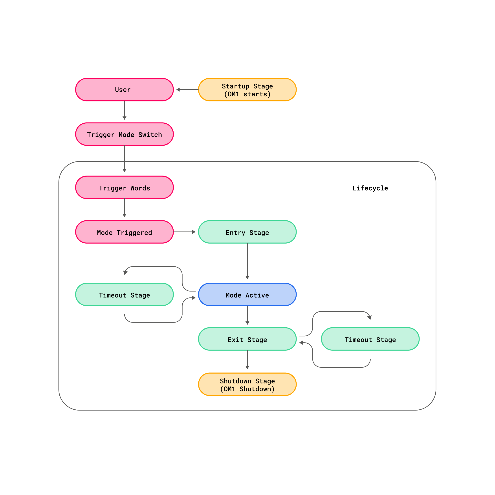

A lifecycle defines the operational boundaries of a mode, from its activation to its completion or transition to another mode. It is responsible for initializing, managing, and safely terminating a mode’s operation, ensuring predictable transitions, consistent state handling, and controlled execution of mode-specific logic. A mode represents a functional state of the robot, such as Guard, SLAM, or Navigation, and each mode runs within a lifecycle that determines how and when it starts, executes, and ends.

Conceptual Model

- Lifecycle – Defines the start, execution, and end of a mode.

- Stage – Represents a logical phase within the lifecycle (e.g., startup, entry, active, exit).

- Hook – A programmable event point that executes specific actions at key stages.

- Mode – The operational context governed by the lifecycle.

In short: Lifecycle controls the flow → Stages define phases → Hooks perform actions → Mode defines behavior.

## Stages and Hooks

- Each lifecycle is composed of several stages.
- Hooks are executed at specific points in these stages to perform initialization, cleanup, or handling tasks.

Stages and associated hooks:

### Startup Stage

Triggered by ON_STARTUP

Executes system-level initialization before any mode begins.

### Entry Stage

Triggered by ON_ENTRY

Runs when entering a mode; prepares mode-specific resources and context.

### Active Stage

Represents the main operational phase of the mode.

No fixed hook; mode logic runs continuously during this stage.

### Exit Stage

Triggered by ON_EXIT

Executes cleanup, saves state, and prepares for the next transition.

### Timeout Stage

Triggered by ON_TIMEOUT

Handles cases where a mode exceeds its defined duration or fails to complete expected actions.

### Shutdown Stage

Triggered by ON_SHUTDOWN

Performs final cleanup and safe termination of the lifecycle management system.
